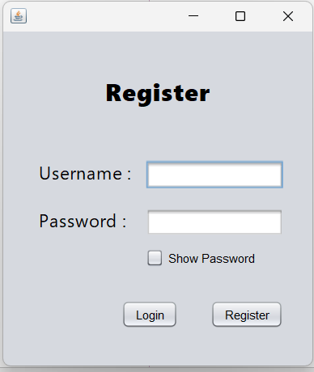

# Login_Register-Apache-Java-XAMPP-SQL

This Java program was built using the Apache NetBeans IDE. It contains two Java frames for the "Login' and "Register" functionalities. Almost all exceptions, including database errors, are handled within the program. An SQL database is used to manage user data, specifically usernames and passwords. XAMPP, an open-source package, was utilized to develop the graphical interface for SQL(phpMyAdmin).

XAMPP Control Panel

SQL Database(phpMyAdmin)

JFrame

[XAMPP Downolad](https://www.apachefriends.org)

[Netbeans Download](https://netbeans.apache.org/front/main/download)
